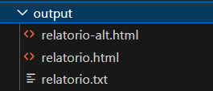

# Projeto 1
Com base no sistema abaixo:  
https://github.com/watinha/es46a-2023-2/tree/strategy/01-design-patterns-template-strategy

Aplicar um padrão de projeto criacional, estrutural e um comportamental. Justifique o porque das escolhas em documentação que aponte, ainda, tres refatorações (use os princípios SOLID). Deve ser construido um script de teste, que garanta a consistencia das saídas esperadas após as alterações.

## 1. Aplicação dos Padrões de Projeto
### 1.1 Padrão Criacional - Factory Method:
A classe ReporterFactory implementa o Factory Method para criar os objetos: CidadesHTMLReporter, CidadesTXTReporter e CidadesAlternativeHTMLReporter. Este padrão permite a criação de diferentes tipos de repórteres com base no formato especificado (html, txt, alt-html).

### 1.2 Padrão Estrutural - Adapter:
A aplicação do padrão Adapter é realizada pelas classes CSVDataAdapter e JSONDataAdapter, que implementam a interface DataAdapter. Este padrão converte a interface de um dado (CSV ou JSON) para um formato que pode ser utilizado pelo sistema, garantindo que as classes de alto nível não sejam diretamente dependentes dos formatos específicos dos dados.

### 1.3 Padrão Comportamental - Strategy:
O padrão Strategy é utilizado para definir diferentes estratégias de relatório (HTMLReportStrategy, TXTReportStrategy, AlternativeHTMLReportStrategy).

## 2. Refatorações Usando os Princípios SOLID
### 2.1. Princípio da Responsabilidade Única (SRP):
Cada classe possui uma única responsabilidade:

ReporterFactory: é responsável pela criação dos repórteres.
CidadesReporter: gerencia o fluxo de geração de relatórios.
As estratégias (HTMLReportStrategy, TXTReportStrategy, AlternativeHTMLReportStrategy) lidam com a lógica específica de formatação de relatórios.

### 2.2. Princípio Aberto/Fechado (OCP):
O sistema é facilmente extensível sem modificar as classes existentes. Adicionar um novo formato de relatório (por exemplo, CSVReporter) pode ser feito estendendo CidadesReporter e implementando uma nova estratégia.

### 2.3. Princípio da Segregação de Interface (ISP):
As interfaces são específicas e pequenas. Por exemplo, DataAdapter define um único método parse, garantindo que as classes que implementam a interface não sejam obrigadas a depender de métodos que não utilizam.

## 3. Verificação dos Requisitos
Requisito 01: Geração de relatório HTML a partir do arquivo cidades-2.json. Implementado pela classe CidadesHTMLReporter com a estratégia HTMLReportStrategy.
Requisito 02: Geração de relatório TXT a partir do arquivo cidades-2.json. Implementado pela classe CidadesTXTReporter com a estratégia TXTReportStrategy.
Requisito 03: Geração de relatório HTML com formato alternativo. Implementado pela classe CidadesAlternativeHTMLReporter com a estratégia AlternativeHTMLReportStrategy.

## 4. Execução do script de teste:
- Digite npm test
- Será criado os seguintes arquivos na pasta output:

## 4. Execução da aplicação:
1- npm install
2- node index.js <filename> <format>, <outputFilename>

- node index.js cidades-2.json alt-html relatorio-alt.html
- node index.js cidades-2.json html relatorio.html
- node index.js cidades-2.json txt relatorio.txt

## Discente

  <table>
    <tr>
      <td>Joice Kelly</td>
    </tr>
  </table>

